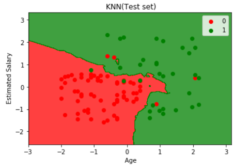

# 逻辑回归和KMN的实现

[hello](https://baidu.com)

都是分类法

KNN：
    <li>欧式距离</li>
    <li>根据距离确定K近邻点</li>
    <li>使用周边数量最多的的最近邻点的类标签来确定该对象的标签</li>

逻辑回归
```
from sklearn.linear_model import LogisticRegression
classifier = LogisticRegression()
classifier.fit(X_train,Y_train)

```
KNN
```
from sklearn.neighbors import KNeighborsClassifier
classifier = KNeighborsClassifier(n_neighbors = 5, metric = 'minkowski', p = 2)
classifier.fit(X_train,Y_train)
```
Results<br>
 

Logistic regression is linear, the edge is smmoth, KNN will find the cluster.


